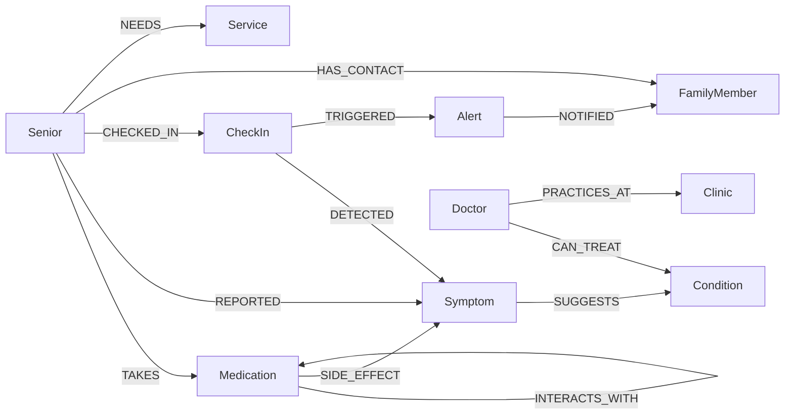

# Neo4j Architecture in CareGraph

CareGraph uses **Neo4j** as its core knowledge graph — modeling seniors, medications, symptoms, conditions, and care providers as a connected graph rather than flat tables. This enables relationship traversals that would require multiple SQL joins to express naturally in a single Cypher query.

---

## Graph Model

```
(:Senior)-[:TAKES]->(:Medication)-[:INTERACTS_WITH]->(:Medication)
(:Senior)-[:REPORTED]->(:Symptom)<-[:SIDE_EFFECT]-(:Medication)
(:Senior)-[:CHECKED_IN]->(:CheckIn)-[:DETECTED]->(:Symptom)
(:Senior)-[:HAS_CONTACT]->(:FamilyMember)
(:Senior)-[:NEEDS]->(:Service)
(:Symptom)-[:SUGGESTS]->(:Condition)
(:CheckIn)-[:TRIGGERED]->(:Alert)-[:NOTIFIED]->(:FamilyMember)
(:Doctor)-[:CAN_TREAT]->(:Condition)
(:Doctor)-[:PRACTICES_AT]->(:Clinic)
```



---

## Setup & Connection

Neo4j runs locally via Docker or connects to **Neo4j Aura** (cloud) — just swap the URI:

```bash
# Local (Docker)
docker run -d --name neo4j -p 7474:7474 -p 7687:7687 \
  -e NEO4J_AUTH=neo4j/careGraph2026 neo4j:5
```

```env
# .env
NEO4J_URI=bolt://localhost:7687        # local
# NEO4J_URI=neo4j+s://xxxx.databases.neo4j.io  # Aura (cloud)
NEO4J_USER=neo4j
NEO4J_PASSWORD=careGraph2026
```

Connection is managed in `app/graph_db.py` via the official Python driver:

```python
from neo4j import GraphDatabase
from app.config import settings

_driver = GraphDatabase.driver(
    settings.neo4j_uri,
    auth=(settings.neo4j_user, settings.neo4j_password),
)
```

---

## Schema (Auto-Applied on Startup)

When the FastAPI app boots, `setup_schema()` is called automatically — no manual migration needed. It creates uniqueness constraints and indexes:

```cypher
CREATE CONSTRAINT IF NOT EXISTS FOR (s:Senior)     REQUIRE s.phone IS UNIQUE
CREATE CONSTRAINT IF NOT EXISTS FOR (m:Medication) REQUIRE m.name IS UNIQUE
CREATE CONSTRAINT IF NOT EXISTS FOR (sy:Symptom)   REQUIRE sy.name IS UNIQUE
CREATE CONSTRAINT IF NOT EXISTS FOR (c:Condition)  REQUIRE c.name IS UNIQUE
CREATE CONSTRAINT IF NOT EXISTS FOR (p:Provider)   REQUIRE p.name IS UNIQUE
CREATE INDEX IF NOT EXISTS FOR (ci:CheckIn) ON (ci.timestamp)
CREATE INDEX IF NOT EXISTS FOR (a:Alert)    ON (a.timestamp)
```

This runs in `main.py`'s FastAPI lifespan:

```python
@asynccontextmanager
async def lifespan(app: FastAPI):
    setup_schema()   # ← runs on startup
    yield
    close_driver()   # ← runs on shutdown
```

---

## Data Insertion

### 1. Seed Script (Demo Data)

`scripts/seed_data.py` populates three demo seniors with realistic medical profiles, known drug interactions, side effects, and simulated check-ins:

```python
# Creates Senior nodes + TAKES relationships
create_senior("Margaret Chen", "+15550001001",
              medications=["Metformin", "Lisinopril", "Atorvastatin"])

# Encodes medical knowledge as graph edges
add_drug_interaction("Metformin", "Lisinopril",
                     "May increase hypoglycemia risk")

add_side_effect("Lisinopril", "dizziness")
add_side_effect("Lisinopril", "dry cough")

add_symptom_condition("dizziness", "Hypotension")
add_symptom_condition("chest pain", "Cardiac Event")
```

All inserts use Cypher `MERGE` — idempotent, safe to run multiple times.

### 2. Runtime Insertion (Live App)

Every voice check-in stores a `CheckIn` node and creates `Symptom`/`Service` nodes from what the senior said:

```cypher
-- CheckIn node linked to Senior
MATCH (s:Senior {phone: $phone})
CREATE (ci:CheckIn {key: $key, mood: $mood, wellness_score: $score, ...})
MERGE (s)-[:CHECKED_IN]->(ci)

-- Symptoms extracted from transcript
MERGE (sy:Symptom {name: $concern})
MERGE (ci)-[:DETECTED]->(sy)
MERGE (s)-[:REPORTED]->(sy)
```

---

## Graph Intelligence Queries

All Cypher for core domain operations lives in `app/graph_db.py`. Key queries:

### Drug Interaction Detection

```cypher
MATCH (s:Senior {phone: $phone})-[:TAKES]->(m1:Medication)
MATCH (m1)-[:INTERACTS_WITH]-(m2:Medication)
WHERE (s)-[:TAKES]->(m2)
RETURN m1.name AS drug1, m2.name AS drug2
```

> "Does this senior take two medications that interact with each other?"

### Symptom ↔ Medication Side Effect Matching

```cypher
MATCH (s:Senior {phone: $phone})-[:TAKES]->(m:Medication)-[:SIDE_EFFECT]->(sy:Symptom)
WHERE (s)-[:REPORTED]->(sy)
RETURN m.name AS medication, sy.name AS symptom
```

> "Is this symptom the senior just reported a known side effect of one of their medications?"

### Similar Symptoms Across Seniors

```cypher
MATCH (s1:Senior {phone: $phone})-[:REPORTED]->(sy:Symptom)<-[:REPORTED]-(s2:Senior)
WHERE s1 <> s2
RETURN sy.name AS symptom, s2.name AS other_senior
```

> "Which other seniors are reporting the same symptoms? Could there be a common cause?"

### Full Care Network (Graph Visualization)

```cypher
MATCH (s:Senior {phone: $phone})
OPTIONAL MATCH (s)-[:TAKES]->(m:Medication)
OPTIONAL MATCH (s)-[:HAS_CONTACT]->(f:FamilyMember)
OPTIONAL MATCH (s)-[:REPORTED]->(sy:Symptom)
OPTIONAL MATCH (s)-[:NEEDS]->(sv:Service)
RETURN s, collect(DISTINCT m), collect(DISTINCT f),
       collect(DISTINCT sy), collect(DISTINCT sv)
```

> "Return everything connected to this senior in one traversal."

---

## Integration Map

Neo4j is the backbone of every part of the app — all layers query through `app/graph_db.py`:

| Layer | File | What it does with Neo4j |
|---|---|---|
| **API — Seniors** | `app/routers/seniors.py` | CRUD: `create_senior`, `get_senior`, `delete_senior` |
| **API — Check-ins** | `app/routers/checkins.py` | Store and retrieve check-in nodes |
| **API — Alerts** | `app/routers/alerts.py` | `get_alerts`, `acknowledge_alert` |
| **API — Graph Intelligence** | `app/routers/graph.py` | Drug interactions, side effects, network visualization, doctor matching |
| **Voice webhook** | `app/routers/voice.py` | Fetches senior profile before call, stores check-in after transcript |
| **Alert engine** | `app/services/alert_engine.py` | Queries `HAS_CONTACT` edges to find family members to notify |
| **Bland AI voice** | `app/services/bland_voice.py` | Pulls matched `Doctor` nodes to include in voice call context |
| **CrewAI agents** | `app/crew/tools.py` | Wraps graph functions as agent tools: `find_drug_interactions`, `get_care_network`, `store_checkin`, etc. |

---

## How the LLM Layer Uses Neo4j

The AI pipelines (RocketRide / GMI Cloud) do **not** connect to Neo4j directly. The Python backend fetches graph data first, then passes it as structured context into the LLM prompt:

```
Voice call → FastAPI
    → Neo4j: fetch senior profile + drug interactions + side effects
    → Compose structured context string
    → RocketRide pipeline (Gemini) / GMI Cloud (Qwen3-235B)
    → Personalized care recommendation
    → Neo4j: store alert if severity threshold met
```

The graph is the **source of truth**; the LLM reasons over graph-backed facts.

---

## Example End-to-End: Dorothy Reports Dizziness

1. Bland AI calls Dorothy → she mentions she feels dizzy
2. Transcript webhook hits FastAPI → NLP extracts `"dizziness"` as a concern
3. `store_checkin()` creates `(:CheckIn)-[:DETECTED]->(:Symptom {name:"dizziness"})` and `(:Senior)-[:REPORTED]->(:Symptom {name:"dizziness"})`
4. `find_medication_side_effects()` runs:
   ```cypher
   MATCH (s:Senior {phone:$phone})-[:TAKES]->(m:Medication)-[:SIDE_EFFECT]->(sy:Symptom)
   WHERE (s)-[:REPORTED]->(sy)
   ```
   → Returns: `Lisinopril → dizziness`
5. Graph insight passed to LLM → care recommendation generated: *"Dorothy's dizziness may be a side effect of Lisinopril — recommend consulting her doctor."*
6. Alert created → family member notified via `HAS_CONTACT` edge traversal

**One graph traversal. No joins. No separate API calls.**
