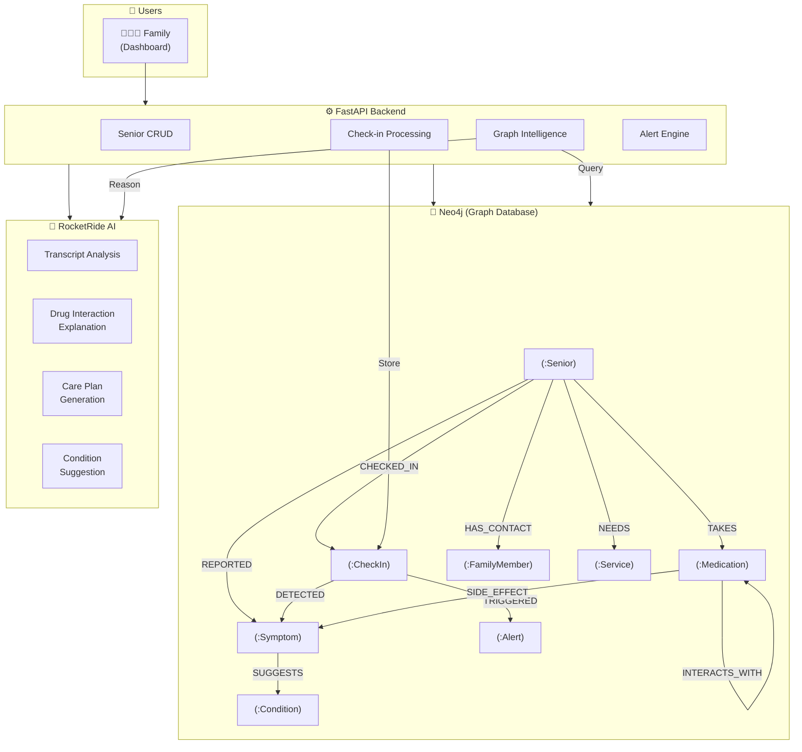

# CareGraph

Graph-powered senior care intelligence with Neo4j + RocketRide AI. Models the complete care network — seniors, medications, symptoms, conditions, services, and family — as a knowledge graph, then uses AI to detect drug interactions, side effects, and generate care recommendations.

## Architecture



## How It Works

1. **Add seniors** with their medications, contacts, and check-in schedule
2. **Simulate check-ins** — enter what the senior said, the system analyzes it
3. **Neo4j builds the graph** — symptoms, medications, conditions all connected
4. **RocketRide AI reasons** — drug interactions, side effects, care recommendations
5. **Graph intelligence** — "Dorothy is dizzy → she takes Lisinopril → dizziness is a side effect of Lisinopril"

## Graph Model

```
(:Senior)-[:TAKES]->(:Medication)
(:Senior)-[:REPORTED]->(:Symptom)
(:Senior)-[:CHECKED_IN]->(:CheckIn)-[:DETECTED]->(:Symptom)
(:Senior)-[:HAS_CONTACT]->(:FamilyMember)
(:Senior)-[:NEEDS]->(:Service)
(:Medication)-[:INTERACTS_WITH]->(:Medication)
(:Medication)-[:SIDE_EFFECT]->(:Symptom)
(:Symptom)-[:SUGGESTS]->(:Condition)
(:CheckIn)-[:TRIGGERED]->(:Alert)
```

## Quick Start

```bash
# Start Neo4j
docker run -d --name neo4j -p 7474:7474 -p 7687:7687 \
  -e NEO4J_AUTH=neo4j/careGraph2026 neo4j:5

# Install dependencies
uv sync

# Start the server
uv run python main.py

# Seed demo data
uv run python scripts/seed_data.py

# Open dashboard
open http://localhost:8000
```

## Key Demo Scenarios

| Scenario | What Neo4j Does | What RocketRide AI Does |
|----------|----------------|------------------------|
| Margaret takes Metformin + Lisinopril | Detects INTERACTS_WITH relationship | Explains the interaction risk |
| Dorothy reports dizziness | Matches symptom to Lisinopril SIDE_EFFECT | Suggests talking to doctor |
| 3 seniors report similar symptoms | Finds shared symptom paths in graph | Identifies potential cause |
| New medication added | Checks all INTERACTS_WITH edges | Flags concerns proactively |

## API Endpoints

### Seniors
- `POST /api/seniors` — Add senior (creates graph nodes)
- `GET /api/seniors` — List all seniors
- `DELETE /api/seniors/{phone}` — Remove senior

### Check-ins
- `POST /api/checkins/simulate/{phone}` — Simulate a check-in
- `GET /api/checkins/{phone}` — Check-in history
- `GET /api/checkins/latest/all` — Latest per senior

### Graph Intelligence
- `GET /api/graph/care-network/{phone}` — Full care network (for visualization)
- `GET /api/graph/drug-interactions/{phone}` — Drug interactions + AI explanation
- `GET /api/graph/side-effects/{phone}` — Symptom ↔ medication matches
- `GET /api/graph/similar-symptoms/{phone}` — Seniors with same symptoms
- `GET /api/graph/care-recommendation/{phone}` — AI-generated care plan
- `GET /api/graph/seniors-by-symptom/{symptom}` — Find seniors by symptom
- `GET /api/graph/seniors-by-medication/{med}` — Find seniors by medication

### Alerts
- `GET /api/alerts` — Active alerts
- `PUT /api/alerts/{id}/acknowledge` — Acknowledge

## RocketRide AI Pipeline Integration

CareGraph uses **RocketRide AI pipelines** (`.pipe` files) to orchestrate AI reasoning. Each pipeline follows the pattern:

```
Webhook (input) → Prompt (template) → Gemini LLM → Response (output)
```

### Pipelines

| Pipeline | File | Purpose |
|----------|------|---------|
| Check-in Analysis | `pipelines/checkin_analysis.pipe` | Extracts symptoms, mood, urgency from transcripts |
| Drug Interaction | `pipelines/drug_interaction.pipe` | Explains medication interactions for caregivers |
| Care Recommendation | `pipelines/care_recommendation.pipe` | Generates personalized care plans from graph data |
| Condition Suggestion | `pipelines/condition_suggestion.pipe` | Suggests conditions from symptom clusters |

### How It Connects

1. Backend calls `POST {ROCKETRIDE_URI}/webhook` with `{"text": "..."}`
2. RocketRide routes through the pipeline: prompt template → Gemini 2.5 Flash
3. Response returned at `resp["data"]["objects"]["body"]["answers"]`
4. If RocketRide is unavailable, falls back to **GMI Cloud** direct inference
5. If neither is configured, graph queries still work (AI explanations are empty)

### Inference Chain

```
RocketRide Pipeline (.pipe webhook) → GMI Cloud (api.gmi-serving.com) → empty fallback
```

### Setup

**RocketRide (primary):**
1. Install **RocketRide VS Code extension** from Marketplace
2. Click rocket icon → Connect → **Local** (runs on port 5565)
3. Open any `.pipe` file → visual pipeline canvas appears
4. Configure the Gemini node with your API key
5. Click play to start the pipeline
6. Set `ROCKETRIDE_APIKEY` in `.env` to the key from the extension

**GMI Cloud (fallback):**
1. Sign up at [console.gmicloud.ai](https://console.gmicloud.ai)
2. Create an API key in organization settings
3. Set `GMI_API_KEY` in `.env`
4. Optionally change `GMI_MODEL` (default: `deepseek-ai/DeepSeek-R1`)

## Tech Stack

| Tool | Role |
|------|------|
| **Neo4j** | Graph database — models care relationships, drug interactions, symptoms |
| **RocketRide AI** | Pipeline orchestration — webhook → prompt → Gemini LLM → response |
| **GMI Cloud** | Direct LLM inference fallback — OpenAI-compatible API at `api.gmi-serving.com` |
| **FastAPI** | Python backend API |
| **Chart.js** | Dashboard visualization |

## Project Structure

```
CareGraph/
├── main.py                    # FastAPI app
├── pipelines/                 # RocketRide AI pipelines (.pipe files)
│   ├── checkin_analysis.pipe  # Transcript analysis pipeline
│   ├── drug_interaction.pipe  # Drug interaction explainer pipeline
│   ├── care_recommendation.pipe # Care plan generation pipeline
│   └── condition_suggestion.pipe # Condition suggester pipeline
├── app/
│   ├── config.py              # Settings
│   ├── graph_db.py            # Neo4j database layer (all Cypher queries)
│   ├── models/
│   │   └── senior.py          # Pydantic models
│   ├── routers/
│   │   ├── seniors.py         # Senior CRUD
│   │   ├── checkins.py        # Check-in processing
│   │   ├── alerts.py          # Alert management
│   │   └── graph.py           # Graph intelligence + RocketRide AI
│   └── services/
│       ├── rocketride.py      # RocketRide webhook + GMI Cloud fallback
│       ├── gmi_inference.py   # GMI Cloud direct inference client
│       ├── call_analyzer.py   # Transcript NLP (local fallback)
│       └── alert_engine.py    # Rule-based alerts
├── frontend/                  # Dashboard
├── data/                      # EHR sample data from HuggingFace
├── scripts/
│   └── seed_data.py           # Demo data with drug interactions
└── tests/
```
