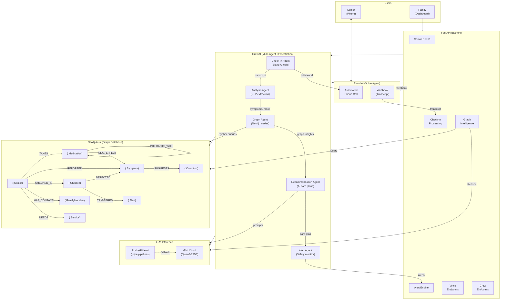
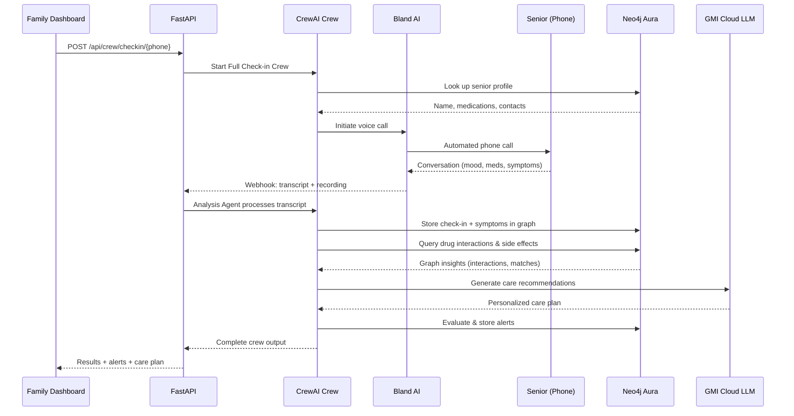

# CareGraph

**AI-powered senior care intelligence built with Neo4j + RocketRide AI + GMI Cloud + Bland AI + CrewAI**

## The problem we're solving

Healthcare for older adults is **episodic**: a clinician might see someone every few months, while daily life—mood, symptoms, meals, mobility, and **dozens of possible medication combinations**—unfolds in between. Isolation and chronic disease mean small changes add up quietly; by the time a crisis hits the ER, the story of *what changed and why* is often incomplete.

**For elders**, that gap shows up as **unnoticed side effects**, **unexplained symptoms written off as “just aging,”** and delayed help when something is wrong. **For family caregivers**, it shows up as **constant worry**, uneven check-ins, medical facts trapped in phone calls and text threads, and the fear of missing the one day that mattered.

CareGraph exists to **shrink that blind spot**: an automated daily touchpoint, a **structured memory of care** (who takes what, what was reported, how it connects in the graph), and **early signals** to caregivers and clinicians—so support is **proactive and dignified**, not only reactive after an emergency.

> Built for HackWithBay 2.0 Hackathon — Theme: Building Intelligent, Graph-Powered Applications with Neo4j and RocketRide AI

**Cloud demo:** The app runs on Render at [https://caregraph.onrender.com](https://caregraph.onrender.com). **This is a demo deployment** for exploring the landing page and dashboard without a local setup; use the Quick Start below for full features, your own keys, and development.

## Neo4j and RocketRide AI

**Neo4j** stores the care knowledge graph: seniors, medications, symptoms, conditions, check-ins, alerts, family contacts, doctors, and clinics as nodes, with typed relationships (for example, who takes which drugs, reported symptoms, drug–drug interactions, and symptom-to-medication side-effect links). The FastAPI backend runs **Cypher** queries against Neo4j (Aura in the cloud, or local/Docker) to power the dashboard: live stats, care-network and doctors-network views, drug-interaction and side-effect detection, cross-senior patterns, and doctor recommendations by traversing the graph instead of flat keyword search. For a deeper dive into the graph model, queries, and design, see [NEO4J_ARCHITECTURE.md](NEO4J_ARCHITECTURE.md).

**RocketRide AI** provides **visual pipeline orchestration** for LLM steps. The `pipelines/` **`.pipe`** files define flows (webhook or prompt → **Gemini** → structured responses) for check-in transcript analysis, plain-language drug-interaction explanations, personalized care recommendations from graph context, and condition suggestions from symptom clusters. RocketRide integrates with the app when its server is running; if a pipeline is unavailable, inference can **fall back to GMI Cloud** (see `app/services/rocketride.py` and the RocketRide section later in this README).

---

## Quick Start

### Prerequisites
- Python 3.12+
- [uv](https://docs.astral.sh/uv/) (package manager)
- Neo4j Aura account (or local Docker) — [console.neo4j.io](https://console.neo4j.io)
- GMI Cloud API key — [console.gmicloud.ai](https://console.gmicloud.ai)
- Bland AI API key (optional, for voice calls) — [bland.ai](https://www.bland.ai)

### 1. Clone and install

```bash
git clone https://github.com/SankarSubbayya/CareGraph.git
cd CareGraph
uv sync
```

### 2. Configure environment

Copy `.env.example` or create `.env`:

```env
# Neo4j (Aura or local)
NEO4J_URI=neo4j+s://your-instance.databases.neo4j.io
NEO4J_USER=neo4j
NEO4J_PASSWORD=your-password

# GMI Cloud (required for AI features)
GMI_BASE_URL=https://api.gmi-serving.com/v1
GMI_API_KEY=your-gmi-api-key
GMI_MODEL=Qwen/Qwen3-235B-A22B-Instruct-2507-FP8

# Bland AI (optional, for voice calls)
BLAND_API_KEY=your-bland-api-key

# RocketRide AI (optional, for pipeline orchestration)
ROCKETRIDE_URI=http://localhost:5565
ROCKETRIDE_APIKEY=

# App
BASE_URL=http://localhost:8000
SKIP_AUTH=true
```

**Using local Neo4j instead of Aura:**
```bash
docker run -d --name neo4j -p 7474:7474 -p 7687:7687 \
  -e NEO4J_AUTH=neo4j/password neo4j:5
```
Then set `NEO4J_URI=bolt://localhost:7687` and `NEO4J_PASSWORD=password`.

### 3. Seed demo data and start

```bash
# Start the server
uv run python main.py

# In another terminal — seed demo data
uv run python scripts/seed_data.py     # 4 seniors, medications, check-ins, alerts
uv run python scripts/seed_doctors.py  # 159 doctors, 38 clinics
```

### 4. Open in browser

| URL | Page |
|-----|------|
| http://localhost:8000 | Landing page |
| http://localhost:8000/dashboard | Full dashboard |

### 5. Run tests

```bash
uv run python -m pytest tests/ -v
```

---

## What CareGraph Does

```
1. Bland AI calls the senior every morning
2. Voice agent asks about mood, medications, symptoms, doctor needs
3. Transcript is analyzed → symptoms extracted → stored in Neo4j graph
4. Graph detects drug interactions, side effect matches, condition suggestions
5. GMI Cloud (Qwen3-235B) generates care plans from graph data
6. Alerts notify family members based on severity
```

### Example: Dorothy reports dizziness

```
Dorothy TAKES Lisinopril
Dorothy REPORTED dizziness
Lisinopril HAS_SIDE_EFFECT dizziness
→ Neo4j connects the dots automatically
→ Qwen3-235B explains: "Dizziness may be a side effect of Lisinopril. Discuss with doctor."
→ Family gets notified
```

---

## Architecture



### Data Flow



---

## Tech Stack

| Layer | Technology | Role |
|-------|-----------|------|
| Graph Database | **Neo4j Aura** | Knowledge graph — 10 node types, 159 doctors, 38 clinics, 1000+ relationships |
| Voice Agent | **Bland AI** | Automated phone calls to seniors with doctor recommendations |
| AI Pipelines | **RocketRide AI** | Visual pipeline orchestration (.pipe files) |
| LLM Inference | **GMI Cloud (Qwen3-235B)** | 235B parameter model for care plans, drug explanations |
| Agent Orchestration | **CrewAI** | 5 specialized agents with 11 custom tools |
| Backend | **FastAPI** | Python REST API — 33 endpoints |
| Frontend | **HTML/JS/vis.js** | Interactive dashboard with graph visualization |

---

## Graph Model

```
(:Senior)-[:TAKES]->(:Medication)
(:Senior)-[:REPORTED]->(:Symptom)
(:Senior)-[:CHECKED_IN]->(:CheckIn)-[:DETECTED]->(:Symptom)
(:Senior)-[:HAS_CONTACT]->(:FamilyMember)
(:Senior)-[:NEEDS]->(:Service)
(:Medication)-[:INTERACTS_WITH]->(:Medication)
(:Medication)-[:SIDE_EFFECT]->(:Symptom)
(:Symptom)-[:SUGGESTS]->(:Condition)
(:Condition)<-[:CAN_TREAT]-(:Doctor)
(:Doctor)-[:PRACTICES_AT]->(:Clinic)
(:CheckIn)-[:TRIGGERED]->(:Alert)
```

---

## Dashboard Pages

| Page | Features |
|------|----------|
| **Home** | Landing page — problem statement, solution flow, live Neo4j stats |
| **Seniors** | List seniors, wellness scores, family contacts, action buttons |
| **Graph View** | Interactive vis.js graph — Care Network + Doctors Network views |
| **Graph Reasoning** | Animated step-by-step walkthrough of Neo4j reasoning chain |
| **AI Insights** | Drug interactions, side effects, condition suggestions, doctor recommendations, cross-senior search |
| **Voice Calls** | Initiate Bland AI calls, voice selection, call history, save to graph |
| **CrewAI Agents** | Visual 5-agent pipeline, run full check-in / analyze / insights |
| **Alerts** | Severity-coded alerts with family notification targets |
| **Simulate** | Enter transcript, see analysis + alerts + family notifications |

---

## Key Demo Scenarios

| Scenario | What Neo4j Does | What AI Does |
|----------|----------------|-------------|
| Margaret takes Metformin + Lisinopril | Detects INTERACTS_WITH relationship | Qwen3-235B explains the interaction risk |
| Dorothy reports dizziness | Matches symptom to Lisinopril SIDE_EFFECT | Suggests talking to doctor |
| 3 seniors report similar symptoms | Finds shared symptom paths in graph | Identifies potential cause |
| Senior needs a doctor | Traverses Symptom → Condition → Doctor → Clinic | Recommends specific doctors |

---

## API Endpoints (33 total)

### Seniors
- `POST /api/seniors` — Add senior
- `GET /api/seniors` — List all
- `GET /api/seniors/{phone}` — Get one
- `DELETE /api/seniors/{phone}` — Remove

### Check-ins
- `POST /api/checkins/simulate/{phone}` — Simulate with transcript
- `GET /api/checkins/{phone}` — History
- `GET /api/checkins/latest/all` — Latest per senior

### Graph Intelligence
- `GET /api/graph/stats` — Live graph statistics
- `GET /api/graph/care-network/{phone}` — Care network visualization
- `GET /api/graph/doctors-network/{phone}` — Doctors network visualization
- `GET /api/graph/drug-interactions/{phone}` — Drug interactions + AI explanation
- `GET /api/graph/side-effects/{phone}` — Side effect matches
- `GET /api/graph/similar-symptoms/{phone}` — Cross-senior symptom patterns
- `GET /api/graph/condition-suggestions/{phone}` — AI condition suggestions
- `GET /api/graph/care-recommendation/{phone}` — AI care plan
- `GET /api/graph/doctors` — Search doctors by specialty/city
- `GET /api/graph/doctors/for-senior/{phone}` — Recommended doctors
- `GET /api/graph/seniors-by-symptom/{symptom}` — Find by symptom
- `GET /api/graph/seniors-by-medication/{med}` — Find by medication

### Voice Agent (Bland AI)
- `POST /api/voice/call/{phone}` — Call a senior
- `POST /api/voice/call-all` — Call all seniors
- `GET /api/voice/call/{call_id}` — Call details + transcript
- `POST /api/voice/call/{call_id}/analyze` — Post-call AI analysis
- `POST /api/voice/call/{call_id}/stop` — Stop call
- `POST /api/voice/process/{call_id}` — Save call transcript to graph
- `GET /api/voice/calls` — Recent calls
- `POST /api/voice/webhook` — Bland AI callback

### CrewAI Agents
- `POST /api/crew/checkin/{phone}` — Full 5-agent pipeline
- `POST /api/crew/analyze/{phone}` — Analysis pipeline (4 agents)
- `POST /api/crew/insights/{phone}` — Graph insights (2 agents)

### Alerts
- `GET /api/alerts` — Active alerts
- `PUT /api/alerts/{id}/acknowledge` — Acknowledge

---

## RocketRide AI Pipelines

4 visual pipelines in `pipelines/` directory:

| Pipeline | Purpose |
|----------|---------|
| `checkin_analysis.pipe` | Transcript → symptoms, mood, urgency |
| `drug_interaction.pipe` | Drug pair → plain-language explanation |
| `care_recommendation.pipe` | Graph data → personalized care plan |
| `condition_suggestion.pipe` | Symptom cluster → possible conditions |

Each follows: `Webhook → Prompt → Gemini LLM → Response`

**Setup:** Install RocketRide VS Code extension → Open .pipe file → Configure Gemini key → Click play

**Inference chain:** RocketRide pipeline → GMI Cloud (Qwen3-235B) fallback → empty

---

## CrewAI Agents

5 agents collaborate on every check-in:

```
Check-in Agent → Analysis Agent → Graph Agent → Recommendation Agent → Alert Agent
  (Bland AI)      (NLP extract)    (Neo4j)       (Qwen3-235B)          (Alerts)
```

| Agent | Tools |
|-------|-------|
| Check-in Agent | Bland AI voice calls, senior lookup |
| Analysis Agent | NLP transcript analyzer, Neo4j store |
| Graph Agent | Drug interactions, side effects, similar symptoms, care network |
| Recommendation Agent | GMI Cloud LLM for explanations and care plans |
| Alert Agent | Severity evaluation, family notification |

---

## Project Structure

```
CareGraph/
├── main.py                        # FastAPI app entry point
├── .env                           # Configuration (gitignored)
├── pipelines/                     # RocketRide AI pipelines
│   ├── checkin_analysis.pipe
│   ├── drug_interaction.pipe
│   ├── care_recommendation.pipe
│   └── condition_suggestion.pipe
├── app/
│   ├── config.py                  # Pydantic settings
│   ├── graph_db.py                # Neo4j Cypher queries (467 lines)
│   ├── crew/                      # CrewAI multi-agent system
│   │   ├── agents.py              # 5 agent definitions
│   │   ├── tasks.py               # Task definitions
│   │   ├── tools.py               # 11 custom tools
│   │   └── care_crew.py           # 3 crew pipelines
│   ├── models/
│   │   └── senior.py              # Pydantic models
│   ├── routers/
│   │   ├── seniors.py             # Senior CRUD
│   │   ├── checkins.py            # Check-in processing
│   │   ├── alerts.py              # Alert management
│   │   ├── graph.py               # Graph intelligence + AI
│   │   ├── voice.py               # Bland AI voice endpoints
│   │   └── crew.py                # CrewAI endpoints
│   └── services/
│       ├── bland_voice.py         # Bland AI client + doctor lookup
│       ├── rocketride.py          # RocketRide + GMI Cloud fallback
│       ├── gmi_inference.py       # GMI Cloud API client
│       ├── call_analyzer.py       # Local NLP analysis
│       └── alert_engine.py        # Alert rules + family notifications
├── frontend/
│   ├── landing.html               # Landing page
│   ├── index.html                 # Dashboard
│   ├── app.js                     # Frontend logic
│   └── style.css                  # Styles
├── scripts/
│   ├── seed_data.py               # Demo seniors + medical knowledge
│   └── seed_doctors.py            # 159 doctors + 38 clinics
├── tests/                         # 60 tests (unit + integration)
├── data/                          # EHR sample data
└── presentation/
    └── DEMO_SCRIPT.md             # 10-slide demo script
```

---

## Tests

60 tests — all passing:

```bash
uv run python -m pytest tests/ -v
```

| Test File | Count | What |
|-----------|-------|------|
| test_models.py | 3 | Pydantic models |
| test_call_analyzer.py | 19 | NLP: mood, meds, symptoms, services |
| test_alert_engine.py | 13 | Alert rules, severity, dedup, source keys |
| test_config.py | 3 | Settings defaults, overrides, Aura alias normalization |
| test_integration.py | 22 | Neo4j queries, API endpoints, full pipelines |

---

## Medical Disclaimer

All AI-generated content includes disclaimers:
- **System prompt** forces: *"This is AI-generated guidance. Always consult your doctor for medical decisions."*
- **Drug interactions**: *"Consult your doctor before making any medication changes."*
- **Condition suggestions**: *"Consult your doctor for proper diagnosis and treatment."*
- **Bland AI voice agent**: *"Your doctor would know best about your specific situation."*
- **Frontend**: Yellow disclaimer banner on all AI results pages

---

## Security

- `.env` is gitignored — never committed
- `.pipe` files use `${ROCKETRIDE_GEMINI_APIKEY}` env var reference — no hardcoded keys
- `.env.example` provided with `<YourKeyHere>` placeholders for deployment
- Optional demo auth via `DEMO_USERNAME` / `DEMO_PASSWORD` (browser basic auth)
- Admin endpoints protected by `ADMIN_API_TOKEN`
- See `PUBLIC_DEMO.md` for deployment guide

---

## Deployment

### Render (one-click)
`render.yaml` blueprint included. See `PUBLIC_DEMO.md` for details.

### Environment Variables
See `.env.example` for all required and optional variables.

---

## Open Source Contribution

We contributed a **Bland AI tool node** to the RocketRide project:
- PR: [rocketride-org/rocketride-server#521](https://github.com/rocketride-org/rocketride-server/pull/521)
- Adds `make_call`, `get_call`, `analyze_call` tools for RocketRide agents

---

## Changelog

| Commit | Change |
|--------|--------|
| Medical disclaimers | All AI responses include "consult your doctor" warnings; frontend yellow banners |
| Config tests fix | Clear env vars before assertions for AliasChoices compatibility |
| Pipe env vars | `.pipe` files use `${ROCKETRIDE_GEMINI_APIKEY}` — no hardcoded API keys |
| Production merge | Security middleware, Render deploy, alert dedup, Aura NEO4J_USERNAME alias |
| AI insights enhanced | Condition suggestions, recommended doctors, cross-senior search by symptom/medication |
| Home link | Dashboard logo + sidebar link back to landing page |
| Demo mode fix | Non-blocking toast in bottom-right corner |
| Graph reasoning | Animated 6-step walkthrough of Neo4j reasoning chain with vis.js graph |
| Family notifications | Alerts notify emergency contacts by severity (critical → all, high → primary) |
| Live stats | Landing page shows real-time Neo4j counts |
| Demo mode | One-click 8-step automated dashboard walkthrough |
| Docs + Qwen3-235B | Updated all docs for GMI Cloud Qwen3-235B model |
| Doctors graph | 159 doctors + 38 clinics in Neo4j; interactive doctors network visualization |
| 60 tests | Unit + integration tests all passing |
| CrewAI | 5 agents, 11 tools, 3 crew pipelines |
| Bland AI voice | Automated check-in calls with doctor recommendations from Neo4j |
| RocketRide pipelines | 4 .pipe files for AI reasoning |
| GMI Cloud | Qwen3-235B inference for care plans, drug explanations |
| Initial | Neo4j graph model, FastAPI backend, dashboard frontend |
